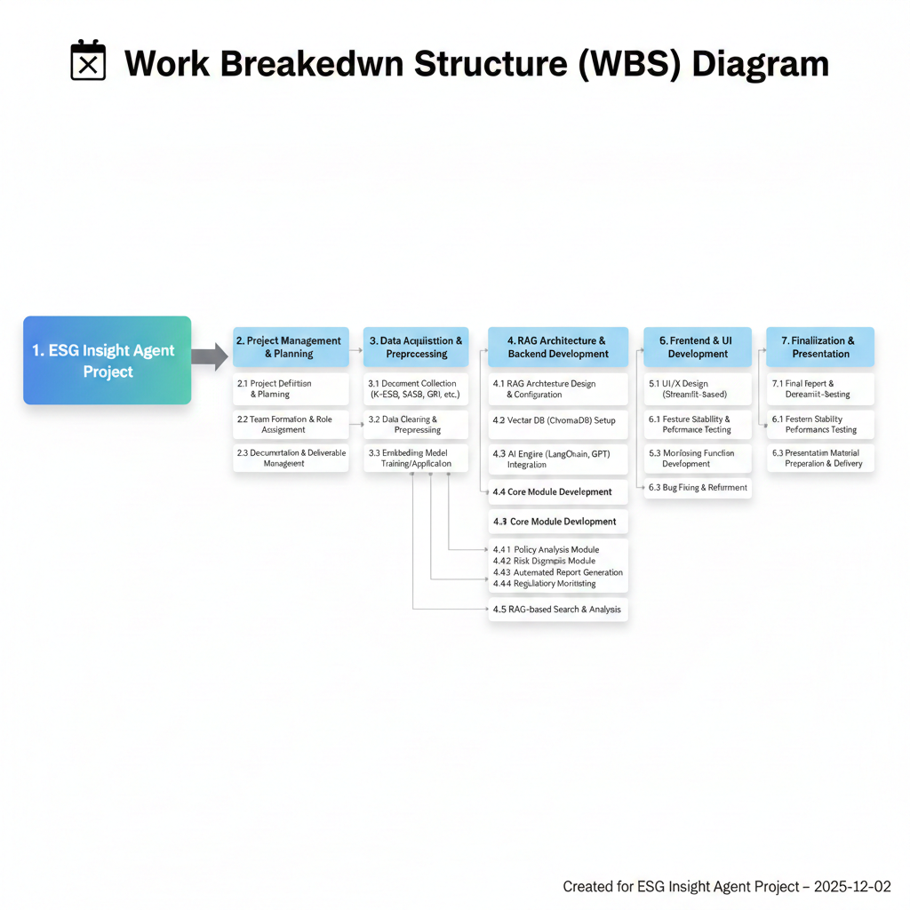

# 🌍 ESG Insight Agent
AI-powered ESG Policy Analysis, Risk Diagnostics & Automated Reporting System

<div align="center">
  
</div>

---

## 📌 Overview
**ESG Insight Agent**는 건설사를 위한 ESG 업무 자동화 AI 시스템으로,  
정책 분석 → 리스크 진단 → 보고서 생성 → 규제 모니터링을 통합적으로 수행합니다.

---

## 🧭 프로젝트 기간
2025-12-02 ~ 2025-12-10

---

## 👥 참여 인원
- 팀원: 박희선, 석상훈, 윤현이, 황정민

---

## 📚 데이터 출처
- K-ESG 공급망 대응 가이드라인
- SASB E&C Standards
- GRI Standards
- 국내 법령 자료
- 주요 건설사 ESG 보고서

---

# 🎯 목표
- ESG 문서 자동 요약 및 비교
- 프로젝트 기반 ESG 리스크 평가
- ESG 보고서 자동 생성(PDF/DOCX)
- 규제 변경 감지 자동화
- RAG 기반 문서 검색 및 분석

---

# 🧩 ESG Reasoning Modules

### ✔ 정책 분석 모듈
- K-ESG / SASB / GRI 자동 비교
- 정책 간 차이 분석 및 가이드 제공

### ✔ 리스크 진단 모듈
- 프로젝트 기반 E/S/G 리스크 자동 평가
- 체크리스트 생성 기능

### ✔ 보고서 자동 생성
- K-ESG 61개 항목 기반
- PDF/DOCX 자동 출력

### ✔ 규제 모니터링
- 기관별 규제 변경 감지
- 주간 리포트 생성


---


# 🔌 3. API Specification

ESG AI Agent 백엔드의 최종 API 엔드포인트 명세서

---

## 📂 File Upload

| 기능 | 메서드 | 엔드포인트 | 설명 |
|------|--------|------------|------|
| 파일 업로드 | **POST** | `/api/upload` | `conversation_id`와 함께 파일 업로드. PDF/TXT 파일을 저장하고 벡터 DB(RAG)에 색인합니다. |

---

## 🧭 Shared Context 조회

| 기능 | 메서드 | 엔드포인트 | 설명 |
|------|--------|------------|------|
| 전체 context 조회 | **GET** | `/api/context` | 현재 에이전트 상태(shared_context) 전체를 조회합니다. |

---

## 🧠 Agent 실행 API

| 기능 | 메서드 | 엔드포인트 | 설명 |
|------|--------|------------|------|
| policy / risk / report / regulation / custom 실행 | **POST** | `/api/agent/{agent_type}` | 정책 분석, 리스크 분석, 보고서 생성, 규제 요약 또는 커스텀 에이전트를 실행합니다. |

---

## 💬 Chat API

| 기능 | 메서드 | 엔드포인트 | 설명 |
|------|--------|------------|------|
| 일반 채팅 | **POST** | `/api/chat` | 요청 1회 → 응답 1회 방식의 일반 채팅 API |
| 스트리밍 채팅 | **POST** | `/api/chat/stream` | SSE 기반 스트리밍 채팅. 토큰이 실시간으로 전송됩니다. |

---

## 🗂️ Conversation System (대화방 시스템)

### 1️⃣ 대화방 목록 조회

| 기능 | 메서드 | 엔드포인트 | 설명 |
|------|--------|------------|------|
| 대화방 목록 조회 | **GET** | `/api/conversations` | 모든 대화방 목록을 최신 업데이트 순으로 반환합니다. |

---

### 2️⃣ 대화방 생성

| 기능 | 메서드 | 엔드포인트 | 설명 |
|------|--------|------------|------|
| 새 대화방 생성 | **POST** | `/api/conversations` | UUID 기반의 새로운 대화방을 생성합니다. |

---

### 3️⃣ 대화방 히스토리 조회

| 기능 | 메서드 | 엔드포인트 | 설명 |
|------|--------|------------|------|
| 대화방 상세 조회 | **GET** | `/api/conversations/{conversation_id}` | 해당 대화방의 메시지 히스토리 전체를 반환합니다. |

---

### 4️⃣ 대화방 업로드 파일 목록 조회

| 기능 | 메서드 | 엔드포인트 | 설명 |
|------|--------|------------|------|
| 대화방 파일 목록 조회 | **GET** | `/api/conversations/{conversation_id}/files` | 해당 대화방에 업로드된 파일 목록을 반환합니다. |

---

### 5️⃣ 대화방 삭제

| 기능 | 메서드 | 엔드포인트 | 설명 |
|------|--------|------------|------|
| 대화방 삭제 | **DELETE** | `/api/conversations/{conversation_id}` | 해당 대화방과 관련된 모든 데이터를 삭제합니다. |

---

## 📝 Notes

- `/api/chat`과 `/api/chat/stream`은 동일한 LLM 로직을 공유하지만 응답 방식이 다릅니다.
- `stream` 엔드포인트는 프론트엔드에서 타이핑 효과(UI 스트리밍)를 구현할 때 사용합니다.
- 업로드된 파일은 대화방 단위로 관리되며 RAG 검색에 활용됩니다.


---

# 🏗️ System Architecture

<div align="center">
  
  
</div>

---

# 🔍 RAG Pipeline

<div align="center">
  
  
</div>

---

# 🗂 WBS Diagram

<div align="center">
  
</div>

---

# 📅 일정 계획 (Gantt Chart)

| 작업 항목 | 시작 | 종료 | 기간(일) |
|---|---|---|---|
| 프로젝트 정의 및 계획 수립 | 2025-12-02 | 2025-12-02 | 1 |
| 문서 수집 | 2025-12-02 | 2025-12-03 | 2 |
| 데이터 전처리 및 임베딩 | 2025-12-03 | 2025-12-04 | 2 |
| RAG 아키텍처 구성 | 2025-12-04 | 2025-12-05 | 2 |
| 핵심 모듈 개발 | 2025-12-05 | 2025-12-07 | 3 |
| UI 및 모니터링 기능 개발 | 2025-12-07 | 2025-12-08 | 2 |
| 통합 테스트 | 2025-12-08 | 2025-12-09 | 2 |
| 발표 | 2025-12-10 | 2025-12-10 | 1 |

---

# 🧪 기술 스택

| 영역 | 기술 |
|---|---|
| Backend | FastAPI, Python |
| AI Engine | GPT-4-mini, LangChain |
| Embedding | bge-m3 |
| DB | ChromaDB |
| Parsing | PyPDF, PyMuPDF, Tesseract |
| Frontend | React |

---

# 📁 문서
더 자세한 문서는 `docs/` 폴더에서 확인하세요.

---

# ▶ 실행 방법

### 1) 라이브러리 설치
```bash
pip install -r requirements.txt
```

### 2) 전체실행 방법
```bash
./run_app.sh
```

---
# 📚 문서 목록

- 📘 기획서: `docs/project_plan.md`
- 🛠 설계서: `README.md`
- 📊 상태 점검표: `docs/mid_review.md`

---

# 📄 License
MIT License
